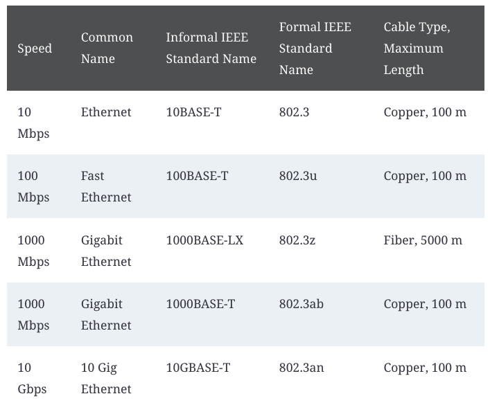

# CCNA Notes

This repository contains CCNA Offical Cert Guide notes which I found important and usefull while preparing for the exam (CCNA 200-301).

- [Chapter 1: Introduction to TCP/IP Networking](#chapter-1-introduction-to-tcpip-networking)
- [Chapter 2: Fundamentals of Ethernet LANs](#chapter-2-fundamentals-of-ethernet-lans)
- [Chapter 3: Fundamentals of WANs and IP Routing](#chapter-3-fundamentals-of-wans-and-ip-routing)

### Chapter 1: Introduction to TCP/IP Networking

- Same-layer interaction on different computers: The two computers use a protocol to communicate with the same layer on another computer. The protocol defines a header that communicates what each computer.
- Adjacent-layer interaction on the same computer: On a single computer, one lower layer provides a service to the layer just above. The software or hardware that implements the higher layer requests that the next lower layer perform the needed function.

### Chapter 2: Fundamentals of Ethernet LANs

### Chapter 3: Fundamentals of WANs and IP Routing
TODO
